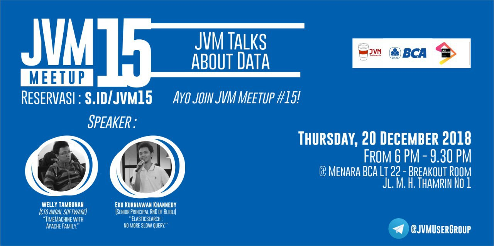

# JVM-Meetup-15
Summarize form JVM Meetup #15 @ Menara BCA Office

JVM Meetup #15 : JVM Talks about Data

Thursday, 20 December 2018

From 6 PM - 9.30 PM

@ Menara BCA 22nd Floor - Breakout Room

Jl MH Thamrin No. 1 Jakarta Pusat

Speaker :

1. Welly Tambunan (CTO Andal Software) -> [Time Machine with Apache Family.](https://drive.google.com/open?id=1ux0M0HURRtHiu82jNrFYZe5YzCbjx2Pz)
2. Eko Kurniawan Khannedy (Senior RnD Blibli) -> [Elasticsearch : No More Slow Query.](https://drive.google.com/open?id=1oZIB5WnVroojak762l--r20cBBc1y5-G)

#### Photo Session

Ayo join JVM User Group di telegram untuk diskusi lebih lanjut.

Join Us : [@JVMUserGroup](http://t.me/JVMUserGroup)

Like & Follow Instagram : [JVM Developer ID](http://instagram.com/jvmdeveloperid)

Like & Follow -> https://www.facebook.com/JVMDeveloperID/